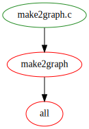

This document describes features and solutions using `gmake', the GNU `make'
program.  Some solutions may also work with other flavors of `make`, but are
usually not tested (by me).

## Visualize Makefile Dependencies

The first step in understanding whether a Makefile can be parallelized is to
view its internal dependencies. This can be done with a tool called
`make2graph`. The tool itself also requires a build.

### Building make2graph

Building `make2graph` is simple: install the dependencies like `dot` and `make`
and run `make` in the project folder.

```bash
git clone https://github.com/lindenb/makefile2graph.git
cd makefile2graph
make
```

This will create the binary tool `make2graph`.

### Create a Dependency Tree

To view a dependency tree of itself do:

```bash
make all -Bnd | ./make2graph | dot -Tpng -o make2graph.png
```

This will create the image `make2graph.png` in the local directory.  If the
complexity of a Makefile is too high for `dot` instead of `.png`, a `.svg` can
be created. Also, if the resulting `png` file cannot be viewed with `display`,
because the size is to high, another program like `eom` can be used.

```bash
make all -Bnd | ./make2graph | dot -Tsvg -o make2graph.svg
```

### View the Results

<!--[{#id .class width=100%}](make2graph.png)-->

[{#id .class width=100%}](make2graph.svg)

## History

| Version | Date       | Notes                                                |
| ------- | ---------- | ---------------------------------------------------- |
| 0.1.0   | 2023-03-02 | Initial release                                      |

