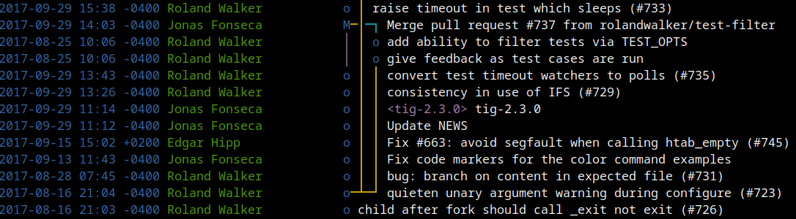

## Introduction

Tig is an ncurses-based front-end to Git, designed to facilitate interaction
with Git repositories through a text-mode interface. It enriches the user
experience by providing an interactive and navigable view.  Configuration of
Tig is managed through the `.tigrc` file or Git configuration files, which
offer a way to customize behavior and presentation according to user
preferences.

The configuration settings in Tig are multifaceted, supporting modifications in
areas such as display options, key bindings, and color schemes. These settings
are processed sequentially from a designated file, allowing users to override
default settings on a per-user or system-wide basis.

Color customization enhances readability by allowing users to set specific
foreground and background colors, along with optional text attributes, for
different areas of the user interface.

Moreover, Tig can be directed to source additional configuration files using
the `source path` command, facilitating modular configuration management. This
feature is particularly useful for organizing complex configurations and
sharing common settings across different setups.

## Installation

Tig is available in the Debian 12 Bookworm repository, and it can install it
using the aptitude or apt package manager. Execute the following command to
install Tig:

```bash
aptitude update
aptitude install tig
tig --version
tig version 2.5.5
ncursesw version 6.3.20211021
readline version 8.2
PCRE2 version 10.42 2022-12-11
```

## Configuration

Tig offers multiple configuration options, allowing both user-specific and
system-wide settings. Here's how Tig determines which configuration files to
use:

1. **User-Specific Configuration**:
   - **Location**: Configuration files can be found in:
     - `$XDG_CONFIG_HOME/tig/config`
     - `~/.config/tig/config`
     - `~/.tigrc`
   - **Loading Sequence**:
     - If the environment variable `$XDG_CONFIG_HOME` is set, Tig will attempt
       to load the configuration from `$XDG_CONFIG_HOME/tig/config`.
     - If `$XDG_CONFIG_HOME` is not set or the aforementioned file doesn't
        exist, Tig then looks for `~/.config/tig/config`.
     - If neither of the above configurations are available, Tig defaults to
       using `~/.tigrc` as the last resort.

2. **System-Wide Configuration**:
   - **Location**: The global configuration file for all users is located at
     `/etc/tigrc`.
   - **Purpose**: This file is used to apply a consistent configuration across
     all users on the system unless overridden by a user-specific configuration
     file.

3. **Git Configuration Files**:
   - Additionally, Tig reads Git's own configuration files.
     - `$GIT_DIR/config` – Configuration specific to the current repository.
     - `~/.gitconfig` – User-specific Git configuration.
     - `/etc/gitconfig` – System-wide Git configuration.

The **Tig Manual (`tigrc(5)`)** gives more information for the Tig specific
configuration options.

## Screenshot

```bash
cd /tmp
git clone https://github.com/jonas/tig
cd tig
tig
```



## Usage

### Simple

```bash
cd /path/to/boxbrainiac
tig
2024-07-18 23:17 +0000 Unknown                o Untracked changes
DT AUTHOR o [main] {origin/main} {origin/HEAD} import escape directly from
DT AUTHOR o Update classifier of setup.py, tested Debian 12, Improve README
DT AUTHOR o Update 0.1.3 Update classifier of setup.py
DT AUTHOR o Update 0.1.0
DT AUTHOR o Ignore to do files
DT AUTHOR o <v0.1.2> Release 0.1.2
DT AUTHOR o The config includes now yaml_path from the start
DT AUTHOR o Create directories, if needed
DT AUTHOR o Update test (change exception to not exit is_git_repo, improve debug
DT AUTHOR o Change exception to not exit is_git_repo, improve debug logging
DT AUTHOR o Adapt vcs tests to GitPython
DT AUTHOR o rename git to vcs
DT AUTHOR o mv (replace dulwich with gitpython)
DT AUTHOR o Change dependency from dulwich to gitpython and bump version
DT AUTHOR o Changed dulwich (python3-dulwich) to git (python3-git) and fix error
DT AUTHOR o rename git.py to vcs.py (to later use GitPython)
DT AUTHOR o Fix png URL for v0.1.1
DT AUTHOR o <v0.1.1> Display ID as box number in GUI
DT AUTHOR o <v0.1.0> Initial commit
DT AUTHOR o Inital commit
DT AUTHOR o Inital commit
DT AUTHOR o Initial commit
DT AUTHOR o Add excludes for vim and data
DT AUTHOR o First real content
DT AUTHOR   Initial commit
[main] Untracked changes
# Replace DT (date time) and AUTHOR with real values
```

Tags like `<0.2.0>` that would be only locally are then listed non-bold or with
a green background, depending on your tig color configuration.

### Display Last 3 Commits

```bash
cd quick-guide-en-us/Dev/VCS/Git
tig -n 3 git.md
2022-07-16 10:04 +0200 Christian Kuelker (s1) o TOC->toc (lowercase toc for
2022-05-30 01:34 +0200 Christian Kuelker (s1) o Change shell to bash for code
2022-05-09 15:22 +0200 Christian Kuelker (s1) o Change section levels (one down
[main] 79912223481803dac61b7d5123449d0cccd141fb - commit 1 of 3            100%
```

### Displays References

```bash
cd quick-guide-en-us
tig refs
                                              All references
DT AUTHOR master         Add gitit.md 0.1.6: Formatting, typos
DT AUTHOR origin/master  Add gitit.md 0.1.6: Formatting, typos
DT AUTHOR origin/HEAD    Add gitit.md 0.1.6: Formatting, typos
DT AUTHOR v0.1.9         Release 0.1.9
DT AUTHOR v0.1.7         Release 0.1.7
DT AUTHOR v0.1.6         History, shell->bash, fix code fence, fix meta
                                data
DT AUTHOR v0.1.5         Release 0.1.5
DT AUTHOR v0.1.4         Release 0.1.4
DT AUTHOR v0.1.3         Release 0.1.3
DT AUTHOR v0.1.2         add 'swap.md' at 2021-05-27
DT AUTHOR v0.1.1         add 'github-manageing-forks.md' at 2021-05-15
DT AUTHOR v0.1.0         rm void link
[refs] All references
# Replace DT (date time) and AUTHOR with real values
```

### Status

```bash
cd boxbrainiac
tig status

On branch main. Your branch is up-to-date with 'origin/main'.
Changes to be committed:
  (no files)
Changes not staged for commit:
  (no files)
Untracked files:
? boxbrainiac/git-dulwich.py
? install/ansible/README.md
? install/ansible/boxbrainiac.yaml
? install/puppet/README.md
? install/puppet/init.pp
[status] Nothing to update                                                 100%
```

## Links

- **Homepage**: <https://jonas.github.io/tig/>
- **Manual**: <https://jonas.github.io/tig/doc/manual.html>
- **Source Code**: <https://github.com/jonas/tig>

## History

| Version | Date       | Notes                                                |
| ------- | ---------- | ---------------------------------------------------- |
| 0.1.0   | 2024-07-18 | Initial release                                      |

