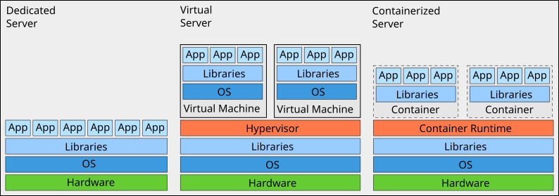

## Introduction

The word Kubernetes ([κυβερνήτης] comes from Greek and means "helmsman" or
"pilot" or "governor", and is the etymological root of cybernetics).

__Dedicated__ servers are easy to maintain and each application can communicate
directly with any other application.

__Virtualized__ servers allow multiple servers (VM) to run on one hardware with
good security separation. Virtualization allows faster response and allocation
of different hardware to applications that have a volatile load.

Containerized servers share some of the advantages of virtualized servers, but
with less security in the separation of instances. The advantage is that there
is only one operating system to manage, at the cost of running only similar
applications.  For example, it would be difficult (or impossible) to run 32-bit
big endian applications together with 64-bit small endian and `arm64`
applications.  Among the many advantages, containerized servers may suffer from
less secure applications because the libraries are application dependent and
are often managed not by experienced system administrators but by software
engineers.  However, this depends very much on the culture of the organization
using the containerized server.

Some advantages of containerized servers are:

- Metrics on application level
- Rollbacks
- Applications are somewhat OS independent
- Resource isolation
- Resource utilization

## History

| Version | Date       | Notes                                                |
| ------- | ---------- | ---------------------------------------------------- |
| 0.1.3   | 2024-02-24 | Fix image                                            |
| 0.1.2   | 2023-03-27 | Improve writing, fix date                            |
| 0.1.1   | 2022-05-09 | +history; PDF: False (no Greek in Noto Sans CJK JP)  |
| 0.1.0   | 2021-05-21 | Initial release                                      |

[κυβερνήτης]: https://en.wikipedia.org/wiki/Kubernetes

