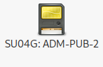
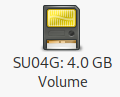
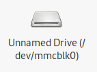
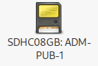

## Introduction

Certain devices, like multi media cards (MMC), are appropriately identified by
their __vendor__ and __product__ attributes, while others are not. This
discrepancy results in some devices being displayed as _"Unnamed Drive"_ within
the desktop environment, such as the MATE desktop using Caja. This document
aims to provide a detailed method for assigning a name to such devices by
implementing an _udev rule_.

## Drive Naming Convention

> 
>
> On the MATE desktop, as well as on other desktop environments and the command
> line, the name of a drive is typically derived from the _product name_ and the
> _disk label_.

> 
>
> In the absence of a _disk label_, the drive's size is used instead.


> 
>
> However, if the _product name_ is missing, the _disk label_ will not
> be displayed; instead, the system defaults to showing the _device name_ (e.g.,
> `/dev/mmcblk0`).

> 
>
> Shows the renamed device after applying the fix with a changed symbol and the
> label.

## Label Assignment

For demonstration, we use two FAT32 formatted SDHC disks. One is named, and the
other is unnamed. Their partition structure is illustrated as follows:

```bash
# Output showing disk and partition details
fdisk -l /dev/mmcblk0
Disk /dev/mmcblk0: 7.51 GiB, 8059355136 bytes, 15740928 sectors
Units: sectors of 1 * 512 = 512 bytes
Sector size (logical/physical): 512 bytes / 512 bytes
I/O size (minimum/optimal): 512 bytes / 512 bytes
Disklabel type: dos
Disk identifier: 0x68c04c1e

Device         Boot Start      End  Sectors  Size Id Type
/dev/mmcblk0p1       2048 15740927 15738880  7.5G  b W95 FAT32
```

To set a disk label, execute:

```bash
# Read current label:
fatlabel /dev/mmcblk0p1
OLDLABEL
# Set new label:
fatlabel /dev/mmcblk0p1 NEWLABEL
```

## Name Determination

Prior to setting a name, it's crucial to identify the current name using tools
such as `udeadm`.

### Functional Drive

Below is an example of a properly recognized drive, clearly displaying
`ID_NAME`:

```bash
# Output showing drive attributes including ID_NAME
udevadm info --query=all --name=/dev/mmcblk0|grep ID_
E: ID_SERIAL=0x002256e1
E: ID_NAME=SU04G
E: ID_PATH=pci-0000:02:00.0-platform-rtsx_pci_sdmmc.0
E: ID_PATH_TAG=pci-0000_02_00_0-platform-rtsx_pci_sdmmc_0
E: ID_PART_TABLE_TYPE=dos
E: ID_DRIVE_FLASH_SD=1
E: ID_DRIVE_MEDIA_FLASH_SD=1
```

This output presents the __product__ and __vendor__:

```bash
lshw -c disk
...
  *-device
       description: SD Card
       product: SU04G
       vendor: SanDisk
       physical id: e624
       logical name: /dev/mmcblk0
       version: 8.0
       date: 01/2013
       serial: 2250465
       size: 3781MiB (3965MB)
       capabilities: sd partitioned partitioned:dos
       configuration: logicalsectorsize=512 sectorsize=512
...
```

### Problematic Drive

Conversely, here is an instance of a problematic drive lacking `ID_NAME`:

```bash
# Output showing missing ID_NAME
udevadm info --query=all --name=/dev/mmcblk0|grep ID_
E: ID_SERIAL=0x00026ff3
E: ID_PATH=pci-0000:02:00.0-platform-rtsx_pci_sdmmc.0
E: ID_PATH_TAG=pci-0000_02_00_0-platform-rtsx_pci_sdmmc_0
E: ID_PART_TABLE_UUID=68c04c1e
E: ID_PART_TABLE_TYPE=dos
E: ID_DRIVE_FLASH_SD=1
E: ID_DRIVE_MEDIA_FLASH_SD=1
````

Notice the __vendor__ 'Unknown (78)' and the absence of __product__:

```bash
# Output showing device details with missing information
lshw -c disk
...
  *-device
       description: SD Card
       vendor: Unknown (78)
       physical id: 1
       logical name: /dev/mmcblk0
       version: 4.4
       date: 07/2008
       serial: 159731
       size: 7686MiB (8059MB)
       capabilities: sd partitioned partitioned:dos
       configuration: logicalsectorsize=512 sectorsize=512 signature=68c04c1e
...
```

### Remedying the Problematic Drive

Although altering the disk firmware is a potential solution (more feasible for
Nvme disks), it's not a viable option for most SDHC disks. Instead, we can
create an _udev rule_ to dynamically assign a name. This is feasible since the
required name is present in the __E__ (environment) section.

First, identify unique strings using `udevadm`:

```bash
# For the operational drive:
udevadm info --attribute-walk /dev/mmcblk0|grep -i serial
    ATTRS{serial}=="0x002256e1"
# For the problematic drive:
udevadm info --attribute-walk /dev/mmcblk0|grep -i serial
    ATTRS{serial}=="0x00026ff3"
```

Create the `udev` rule:

```bash
cd /etc/udev/rules.d
echo\
 'SUBSYSTEM=="block", ATTRS{serial}=="0x00026ff3", ENV{ID_NAME}="SDHC08GB"' >\
 99-custom-disk-name.rules
```

Apply the rule:

```bash
udevadm control --reload-rules
udevadm trigger /dev/mmcblk0
```

Reinsert the disk to effectuate the changes.

### Post-Fix Status of the Problematic Drive

Observe the now-present `ID_NAME`:

```bash
# Output showing the updated ID_NAME
udevadm info --query=all --name=/dev/mmcblk0|grep ID_
E: ID_SERIAL=0x00026ff3
E: ID_PATH=pci-0000:02:00.0-platform-rtsx_pci_sdmmc.0
E: ID_PATH_TAG=pci-0000_02_00_0-platform-rtsx_pci_sdmmc_0
E: ID_PART_TABLE_UUID=68c04c1e
E: ID_PART_TABLE_TYPE=dos
E: ID_DRIVE_FLASH_SD=1
E: ID_DRIVE_MEDIA_FLASH_SD=1
E: ID_NAME=SDHC08GB
```

## Understanding the Hierarchy in Udev

Udev processes information hierarchically. Consequently, the _environment_ and
the key `ID_NAME` are applied multiple times throughout the device tree:

```bash
# Hierarchical display of device attributes
udevadm info -t /dev/mmcblk0|egrep -e 'SERIAL|NAME'
  ┆ E: PCI_SLOT_NAME=0000:00:1c.0
    ┆ E: PCI_SLOT_NAME=0000:02:00.0
          ┆ E: MMC_NAME=
            ┆ E: DEVNAME=/dev/mmcblk0
            ┆ E: ID_SERIAL=0x00026ff3
            ┆ E: ID_NAME=SDHC08GB
              ┆ E: DEVNAME=/dev/mmcblk0p1
              ┆ E: ID_SERIAL=0x00026ff3
              ┆ E: ID_NAME=SDHC08GB
```

Catching `ACTION=="add"` via the `udev` rule would propagate `ID_NAME` to all
children of `mmcblk0` and itself, when the drive information tree is added.
However, upon unmounting a partition, `ID_NAME` would be removed, rendering
`ACTION=="add"` unsuitable.

To refine the `udev` rule, consider adding a symbolic link. Unlike a named
`mmc`, an unnamed `mmc` cannot be accessed via a `/dev/` link containing its
name. `SYMLINK+=` could be used for this purpose, but it is not essential for
this basic example.

## Ansible Playbook

This Ansible playbook is designed to apply specific `udev` rules across a group
of client systems. It focuses on the automation of `udev` rule deployment for
disk naming. The above example is added.

```ansible
---
- name: Configure udev rules for disk names
  hosts: role_client
  gather_facts: no
  become: yes
  vars:
    ns: udev
  tasks:
    - name: "{{ns}}: Define udev rules"
      ansible.builtin.set_fact:
        udev_rules:
            # 8GB SDHC MMC from Intenso with label ADM-PUB-1
          - 'SUBSYSTEM=="block", ATTRS{serial}=="0x00026ff3", ENV{ID_NAME}="SDHC08GB"'
    - name: "{{ns}}: Create udev rule file"
      ansible.builtin.copy:
        dest: /etc/udev/rules.d/99-custom-disk-name.rules
        content: "{{ udev_rules | join('\n') }}"
        mode: '0644'
      register: udev_rule_file
    - name: "{{ns}}: Reload udev rules"
      ansible.builtin.command:
        cmd: udevadm control --reload-rules
      when: udev_rule_file.changed
```

## History

| Version | Date       | Notes                                                |
| ------- | ---------- | ---------------------------------------------------- |
| 0.1.1   | 2024-03-04 | Minor improvements, reformatting 2nd section         |
| 0.1.0   | 2024-03-03 | Initial release                                      |

