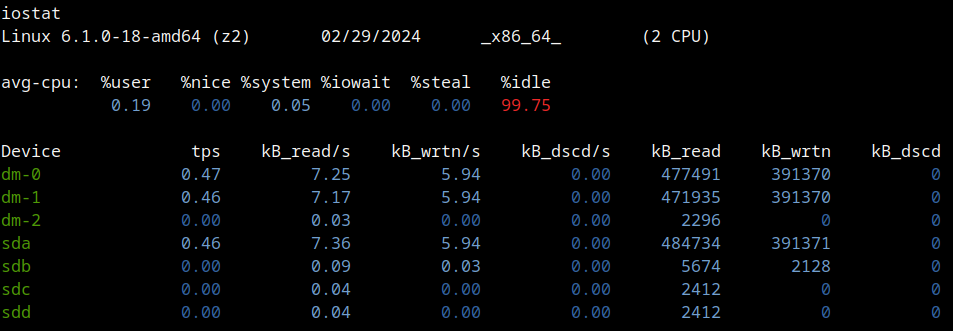
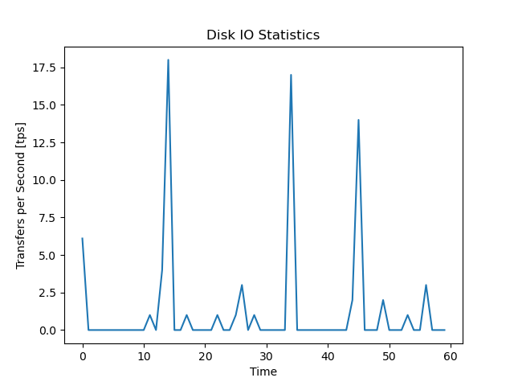
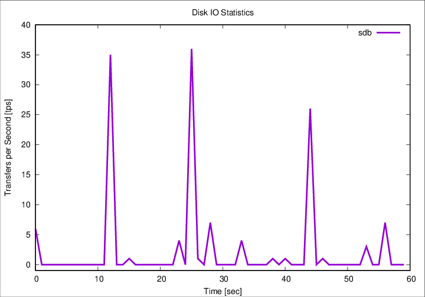

## Introduction

The `iostat` command, a critical component of the `sysstat` package, is
instrumental in reporting CPU utilization alongside disk I/O statistics. For a
comprehensive understanding of the suite of tools included in the `sysstat`
package, please refer to the [Sysstat](sysstat.md) documentation.
To ensure the proper functioning of `iostat`, it is imperative that the `/proc`
file-system be mounted. It is noteworthy that `iostat` is compatible with Linux
kernels version 2.6.x and above, as support for older versions has been
discontinued.

An important clarification regarding the terminology used by `iostat` is its
reference to data measurement units. While terms like kilobytes (kB) and
megabytes (MB) are commonly used, `iostat` actually employs kibibytes (kiB) and
mebibytes (MiB), respectively. A kibibyte is equivalent to 1024 bytes, and
similarly, a mebibyte corresponds to 1024 kibibytes. This distinction is
crucial for accurate data interpretation and system analysis.

## Installation

```bash
aptitude install sysstat
```

## Usage

The simplest way to utilize `iostat` is by executing the command without any
additional parameters. Simply typing `iostat` in the command line provides a
quick snapshot of the system's I/O statistics. To illustrate the versatility
and the range of information that `iostat` can offer, this section presents
five distinct output examples. Each example is derived from different machines,
showcasing how `iostat` adapts to various system environments and
configurations.

__Example 1:__

An older server in 2020 with a software RAID produced this output:

```bash
iostat
Linux 4.19.0-12-amd64 (smtp)   03/12/20   _x86_64_  (2 CPU)

avg-cpu:  %user   %nice %system %iowait  %steal   %idle
           0.60    0.00    0.33    0.81    0.00   98.26

Device             tps    kB_read/s    kB_wrtn/s    kB_read    kB_wrtn
sdb               4.48        23.13        49.63     454297     974773
sda               8.33        83.12        22.94    1632542     450485
md0               0.02         0.30         0.00       5901         28
md1               9.58        78.69        21.76    1545389     427308
```

__Example 2:__

Newer version (on an old machine) also include `dm` devices (in color)
on Debian 12 Bookworm:



__Example 3:__

```bash
iostat
Linux 6.1.0-18-amd64 (host)   02/29/2024   _x86_64_  (4 CPU)

avg-cpu: %user   %nice %system %iowait  %steal   %idle
         18.52    0.00    6.39    0.03    0.00   75.06

Device  tps  kB_read/s  kB_wrtn/s  kB_dscd/s   kB_read    kB_wrtn    kB_dscd
dm-0   6.22       9.11     253.99      14.61   6385739  177975346   10235216
dm-1   6.15       9.05     253.99      14.61   6343319  177975346   10235216
dm-2   0.00       0.00       0.00       0.00      2296          0          0
dm-3   0.23       5.00       0.42       0.00   3504132     293592          0
dm-4   0.23       4.94       0.42       0.00   3463460     293592          0
dm-5   0.00       0.00       0.00       0.00      1044          0          0
sda    0.00       0.01       0.00       0.00      3808          0          0
sdb    6.08       9.12     253.99      15.07   6393024  177975349   10560917
sdc    0.22       5.01       0.42       0.00   3512376     293592          0
```

__Example 4:__

```bash
iostat
Linux 6.1.0-18-amd64 (host)   02/29/2024   _x86_64_  (4 CPU)

avg-cpu:  %user   %nice %system %iowait  %steal   %idle
           0.23    0.00    0.11    0.01    0.00   99.65

Device   tps  kB_read/s  kB_wrtn/s  kB_dscd/s    kB_read    kB_wrtn    kB_dscd
dm-0    1.31      20.03      16.90       0.00    1793052    1512546          0
dm-1    1.30      19.95      16.90       0.00    1785960    1512546          0
dm-2    0.00       0.03       0.00       0.00       2296          0          0
nvme0n1 0.01       0.17       0.00       0.00      15358          1          0
sda     1.28      20.15      16.90       0.00    1803734    1512548          0
```

__Example 5:__

On Debian 11 Bullseye a Raspberry PI 4 with 8GB RAM:

```bash
Linux 5.10.0-28-arm64 (host)   02/29/2024   _aarch64_  (4 CPU)

avg-cpu:  %user   %nice %system %iowait  %steal   %idle
           0.73    0.00    0.38    0.01    0.00   98.89

Device   tps  kB_read/s  kB_wrtn/s  kB_dscd/s    kB_read    kB_wrtn    kB_dscd
sda     0.64       1.21       6.72     105.79    1605164    8941067  140663032
```

## Reports

The `iostat` command methodically generates two pivotal reports that are
essential for a comprehensive analysis of system performance:

1. __CPU Utilization Report__ (with the parameter `-c`):
This report describes the CPU usage patterns. It gives details about system,
user, iowait, and idle distribution of CPU usage. By analyzing this data, one
can pinpoint CPU performance bottlenecks, understand load distribution, and
optimize the computational efficiency of the system.

2. __Device Utilization Report__ (with the parameter `-d`): The second report
focuses on the behavior of storage devices. It gives metrics such as the number
of reads and writes per second, the amount of data transferred, and the overall
throughput of the device. This report is useful for diagnosing I/O performance
issues, planning capacity after real world tests, and ensuring the storage
subsystems are operating within their parameters.

For a more granular understanding of these reports, reported values and units,
the `iostat` manual page provides exhaustive documentation.

## Medium Usage

__Print device partition information:__

Loop back devices with no activity can be skipped with `-z`.

```bash
iostat -p ALL
Linux 6.1.0-18-amd64 (host)   02/29/2024   _x86_64_  (4 CPU)

avg-cpu:  %user   %nice %system %iowait  %steal   %idle
           0.27    0.00    0.13    0.01    0.00   99.58

Device     tps  kB_read/s  kB_wrtn/s  kB_dscd/s  kB_read    kB_wrtn    kB_dscd
sda       1.29      20.01      17.55       0.00  1803754    1582595          0
sda1      0.00       0.03       0.00       0.00     2344          0          0
sda2      0.00       0.06       0.00       0.00     5638          2          0
sda3      1.28      19.90      17.55       0.00  1793808    1582593          0
nvme0n1   0.01       0.17       0.00       0.00    15358          1          0
nvme0n1p1 0.00       0.08       0.00       0.00     7285          1          0
nvme0n1p2 0.00       0.01       0.00       0.00      840          0          0
nvme0n1p3 0.00       0.03       0.00       0.00     2373          0          0
nvme0n1p4 0.00       0.03       0.00       0.00     2344          0          0
dm-0      1.31      19.89      17.55       0.00  1793072    1582593          0
dm-1      1.30      19.81      17.55       0.00  1785980    1582593          0
dm-2      0.00       0.03       0.00       0.00     2296          0          0
loop0     0.00       0.00       0.00       0.00        0          0          0
loop1     0.00       0.00       0.00       0.00        0          0          0
loop2     0.00       0.00       0.00       0.00        0          0          0
loop3     0.00       0.00       0.00       0.00        0          0          0
loop4     0.00       0.00       0.00       0.00        0          0          0
loop5     0.00       0.00       0.00       0.00        0          0          0
loop6     0.00       0.00       0.00       0.00        0          0          0
loop7     0.00       0.00       0.00       0.00        0          0          0
```

__Short Reports:__

Print the 80 columns short version (in contrast to the extended version with
`-x`)

```bash
iostat -s
Linux 6.1.0-18-amd64 (host)   02/29/2024   _x86_64_  (4 CPU)

avg-cpu:  %user   %nice %system %iowait  %steal   %idle
           0.29    0.00    0.14    0.01    0.00   99.56

Device             tps    kB_read/s     kB_w+d/s    kB_read     kB_w+d
dm-0              1.31        19.84        17.53    1793072    1584954
dm-1              1.30        19.76        17.53    1785980    1584954
dm-2              0.00         0.03         0.00       2296          0
nvme0n1           0.01         0.17         0.00      15358          1
sda               1.28        19.96        17.53    1803754    1584956
```

__Collaboration With Other Linux Commands:__

Simple evocation of `iostat` can be combined with the `watch` command to
constantly monitor one or more devices every 2 seconds (default value of
`watch`), in short form for example.

```bash
watch iostat -ds
```

__Monitoring Disk Utilization in Real-Time with Specific Intervals and Counts:__

To continuously monitor disk I/O and CPU statistics in real time, `iostat` can
be run with specified intervals and counts. For example, `iostat -dx 5 6` will
display detailed disk statistics (-d for disk, -x for extended metrics) every 5
seconds, and repeat this process 6 times. This is particularly useful for
observing system behavior under varying loads or for short-term performance
testing.

```bash
iostat 2          # Execute iostat every 2 seconds
iostat 2 4        # Execute every 2 seconds, 4 times in total
iostat -x sda 2 4 # Exectute every 2 seconds, 4 times, for /dev/sda
```

## Advanced Usage

The first column, labeled _tps_, represents the number of transfers issued to
the device per second. Essentially, a transfer is an I/O request to the device.
It's important to note that multiple logical requests may be merged into a
single I/O request. The size of each transfer is not fixed, varying based on
the nature and requirements of the requests.

```bash
iostat -d 1 60
Device   tps  kB_read/s  kB_wrtn/s  kB_dscd/s  kB_read  kB_wrtn  kB_dscd
sdb     7.00       0.00      25.50       0.00        0       25        0
```

The following Python [script](iostat-tps-split-mathplotlib) capture the _tps_
from `/dev/sdb/` for 1 minute with the resolution of 1 second.

```python
import subprocess
import matplotlib.pyplot as plt

# Run iostat and capture its output
output = subprocess.check_output(["iostat", "-d", "1", "60"]).decode()

# Parse iostat output to extract disk io stats
lines = output.splitlines()
io_stats = [float(line.split()[1]) for line in lines if "sdb" in line]

# Plotting the disk io stats
plt.plot(io_stats)
plt.title('Disk IO Statistics')
plt.xlabel('Time [sec]')
plt.ylabel('Transfers per Second [tps]')
plt.show()
```

The output is a PNG graph on screen and can be saved.



Similar statistics can be collected with the JSON interface of `iostat`.  Just
for the sake of doing something different the following Perl
[script](iostat-tps-json-gnuplot) uses GnuPlot and ImageMagic. For this to work
`Chart::Gnuplot` needs to be installed.

```bash
aptitude install libchart-gnuplot-perl
```

This will install at least

- aglfn
- gnuplot-data
- gnuplot-nox
- groff
- libchart-gnuplot-perl
- psutils

In addition ImageMagic has to be configured to read and write Postscript.
Edit the file `/etc/ImageMagick-6/policy.xml` and change the line
`<policy domain="coder" rights="none" pattern="PS" />` to
`<policy domain="coder" rights="read|write" pattern="PS" />`

```perl
use strict;
use warnings;
use JSON;
use Chart::Gnuplot;

my $json_text = qx(iostat -d -o JSON sdb 1 60);

my @io_stats = map { $_->{'disk'}[0]{'tps'} }
   @{ decode_json($json_text)->{'sysstat'}{'hosts'}[0]{'statistics'} };

my $chart = Chart::Gnuplot->new(
    output => "iostat-tps-json-gnuplot-0.1.0.png",
    title  => "Disk IO Statistics",
    xlabel => "Time [sec]",
    ylabel => "Transfers per Second [tps]",
    bg => 'white',
    yrange => [ -1, "*" ],
);

my $dataSet = Chart::Gnuplot::DataSet->new(
    ydata => \@io_stats,
    title => "sdb",
    style => "lines",
    width => 5,
);

$chart->plot2d($dataSet);
```



## Links

- Home page <https://sysstat.github.io/>
- Source <https://github.com/sysstat/sysstat>
- Discontinued home page <http://sebastien.godard.pagesperso-orange.fr/>
- [mpstat](mpstat.md "MpStat")

## History

| Version | Date       | Notes                                                |
| ------- | ---------- | ---------------------------------------------------- |
| 0.1.3   | 2024-03-05 | Add link to mpstat                                   |
| 0.1.2   | 2024-03-01 | Fix link, mv, improve script, add JSON Perl script   |
| 0.1.1   | 2024-02-29 | Advanced example, more outputs                       |
| 0.1.0   | 2021-05-13 | Initial release                                      |

