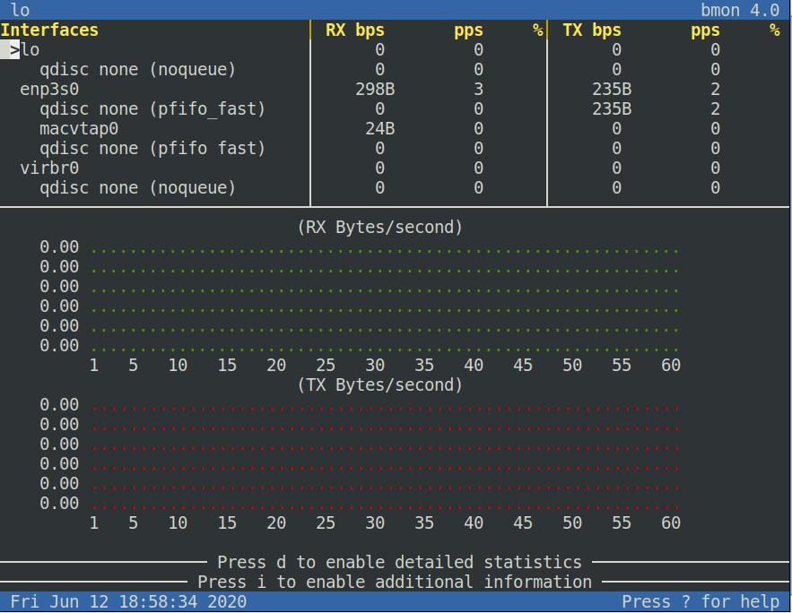

The monitoring and debugging tool [bmon] can be used to capture network related
statistics inside a terminal and present them in an intuitive way. It provides
several output methods, including an interactive curses UI and a programmable
text output that can be used for scripting.

## Installation

```bash
aptitude install bmon
```

Will install `bmon`, `libconfuse-common` and `libconfuse1`.

## Usage



```bash
bmon
```

## Links

- [bmon] redirects to [github]

## History

| Version | Date       | Notes                                                |
| ------- | ---------- | ---------------------------------------------------- |
| 0.1.2   | 2023-04-05 | Improve writing                                      |
| 0.1.1   | 2022-06-03 | Change shell->bash, +history                         |
| 0.1.0   | 2020-06-12 | Initial release                                      |

[bmon]: http://www.infradead.org/~tgr/bmon/
[github]: https://github.com/tgraf/bmon/
