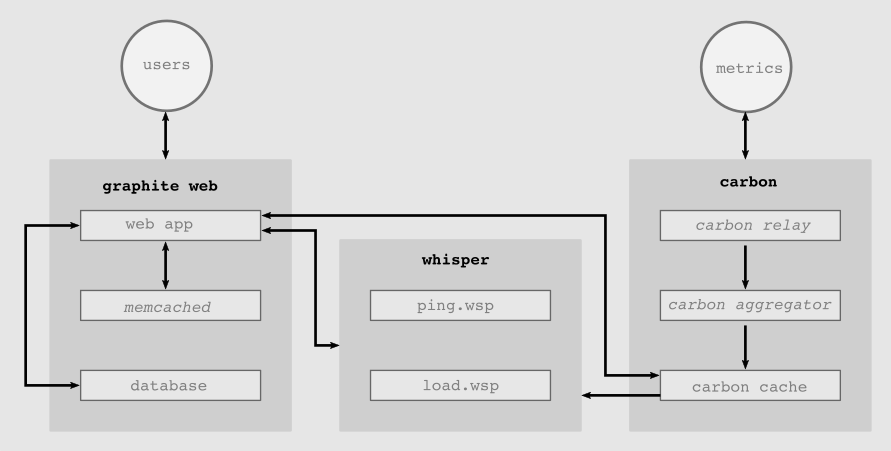

[Icinga2] is a monitoring system which checks the availability of network
resources and generates performance data. This document describes the
installation of [Icinga2], [Icingaweb2], Carbon, Graphite and other software.

[Icinga2] has some modules as add-on:

* Reporting Module: display the data directly within the [Icinga2] web
  interface or export it to PDF, JSON or CSV format
* [Graphite] Module: is a time-series database storing collected metrics and
  making them available through restful API's and web interfaces
* [InfluxDB] is a time series, metrics, and analytics database
* [Grafana] a front-end of [InfluxDB]
* PNP: is a graphing add-on.
* Visualization: displays host objects as markers on Openstreetmap
* Business Process: Rules express dependencies between existing hosts and
  services and alert on application level.
* Certificate Monitoring
* Dashing Dashboard: combines several popular widgets
* Log Monitoring: correlate events with your monitoring

Not handled in this document:

* [Installation via puppet](https://icinga.com/products/integrations/puppet/)
* [check_md_raid](https://exchange.icinga.com/exchange/check_md_raid) and
  [Raid monitoring plugin](https://www.thomas-krenn.com/de/wiki/Linux_Software_RAID_Monitoring_Plugin)
* [Classic UI](https://www.thomas-krenn.com/de/wikiDE/images/d/d1/Icinga-classicui-nrpe-check_raid.png)
* Usage of [MySQL] or [MariaDB] for [Graphite]
* Access to Graphite-Web via user and password

### Difference Between Icinga2 and Prometheus

[Icinga2] is written in mind of dedicated hosts that are up 24/7 and Prometheus
is written in mind of containers or [Kubernetes] clusters that are volatile,
and may not exist as a "hostname" object. Using [Icinga2] on those objects
would lead to false alarms.

[Icinga2] is an active "pull" system where the server actively check the status
of the state of the client to monitor. Prometheus is a passive "push" listener
that scrapes data from individual services executed on the target clients, in a
configured interval. Per default Prometheus will not complain or send alarms if
a metric is not coming from the client or if it can not scrape the data from a
client, unlike [Icinga2].

[Icinga2] (unlike  Prometheus) was not build as a time series metric collector,
but as a "state probe" service.

The micro services approach of Prometheus require each functionality to be a
separate service that has to be managed and configured.

Prometheus’s own graphical interface is minimal and require a 3rd party tool,
like [Grafana].


| Topic                              | Icinga2               | Prometheus |
| ---------------------------------- | --------------------- | ---------- |
| Data Retrieval                     | pull                  | push       |
| Data Retrieval Protocol Protection | SSL                   | None       |
| Service Checks                     | yes                   | no [1]     |
| Metrics                            | yes                   | yes        |
| Metrics Checks                     | yes                   | yes        |
| Database Support                   | [MariaDB], [InfluxDB] | own        |
| Time Series Collections            | no                    | yes        |
| Good graphical Interface           | yes                   | no         |
| Supports [Grafana]                 | yes                   | yes        |

    [1]: but metrics can be used

## Icinga2 Installation

This will install **icinga2** on Debian 10 Buster with a web interface
**icingaweb2** under **nginx** with **mariadb**.

```shell
# aptitude update
# aptitude install icinga2
```

This will install version 2.10.3-2 and source and the following dependencies:

```
icinga2 icinga2-bin icinga2-common icinga2-doc monitoring-plugins-basic
monitoring-plugins-common
```

[Icinga2] uses [Nagios] plugins

```shell
# aptitude install nagios-nrpe-plugin nagios-plugins-contrib
```

Using monitoring plugins enables **icinga2** to query external services.
The location for that tools is: `/usr/lib/nagios/plugins`

Check if the **icinga2** daemon is started

```shell
ps -e|grep icinga
13368 ?        00:00:01 icinga2
13402 ?        00:00:00 icinga2
```

If you believe in `systemd`

```shell
# systemctl status icinga2
● icinga2.service - Icinga host/service/network monitoring system
   Loaded: loaded (/lib/systemd/system/icinga2.service; enabled; vendor preset:
           enabled)
   Active: active (running) since Fri 2020-05-22 10:27:51 CEST; 2 weeks 1 days
           ago
     Docs: https://icinga.com/docs/icinga2/latest/
  Process: 464 ExecStartPre=/usr/lib/icinga2/prepare-dirs
           /usr/lib/icinga2/icinga2 (code=exited, status=0/SUCCESS)
 Main PID: 741 (icinga2)
    Tasks: 13 (limit: 2353)
   Memory: 56.6M
   CGroup: /system.slice/icinga2.service
           ├─741 /usr/lib/x86_64-linux-gnu/icinga2/sbin/icinga2
             --no-stack-rlimit daemon -e
           └─789 /usr/lib/x86_64-linux-gnu/icinga2/sbin/icinga2
             --no-stack-rlimit daemon -e
```

So far the following packages have been installed.

```shell
$ dpkg -l |egrep -e 'icinga|monitoring-plugins'
ii  icinga2                    2.10.3-2  amd64  host and network monitoring ...
ii  icinga2-bin                2.10.3-2  amd64  host and network monitoring ...
ii  icinga2-common             2.10.3-2  all    host and network monitoring ...
ii  icinga2-doc                2.10.3-2  all    host and network monitoring ...
ii  monitoring-plugins-basic   2.2-6     amd64  Plugins for nagios compatib ...
ii  monitoring-plugins-common  2.2-6     amd64  Common files for plugins fo ...
```

Understand which features are enabled:

```shell
# icinga2 feature list
Disabled features: api command compatlog debuglog elasticsearch gelf graphite \
influxdb livestatus opentsdb perfdata statusdata syslog
Enabled features: checker mainlog notification
```

Test if the configuration is OK:

```shell
# icinga2 daemon -C
[2020-06-09 ...] information/cli: Icinga application loader (version: r2.10.3-1)
[2020-06-09 ...] information/cli: Loading configuration file(s).
[2020-06-09 ...] information/ConfigItem: Committing config item(s).
[2020-06-09 ...] information/ConfigItem: Instantiated 1 NotificationComponent.
[2020-06-09 ...] information/ConfigItem: Instantiated 1 CheckerComponent.
[2020-06-09 ...] information/ConfigItem: Instantiated 1 UserGroup.
[2020-06-09 ...] information/ConfigItem: Instantiated 3 TimePeriods.
[2020-06-09 ...] information/ConfigItem: Instantiated 1 ScheduledDowntime.
[2020-06-09 ...] information/ConfigItem: Instantiated 1 User.
[2020-06-09 ...] information/ConfigItem: Instantiated 3 Zones.
[2020-06-09 ...] information/ConfigItem: Instantiated 3 ServiceGroups.
[2020-06-09 ...] information/ConfigItem: Instantiated 12 Services.
[2020-06-09 ...] information/ConfigItem: Instantiated 2 HostGroups.
[2020-06-09 ...] information/ConfigItem: Instantiated 1 Host.
[2020-06-09 ...] information/ConfigItem: Instantiated 2 NotificationCommands.
[2020-06-09 ...] information/ConfigItem: Instantiated 13 Notifications.
[2020-06-09 ...] information/ConfigItem: Instantiated 1 IcingaApplication.
[2020-06-09 ...] information/ConfigItem: Instantiated 1 Endpoint.
[2020-06-09 ...] information/ConfigItem: Instantiated 1 Downtime.
[2020-06-09 ...] information/ConfigItem: Instantiated 1 FileLogger.
[2020-06-09 ...] information/ConfigItem: Instantiated 215 CheckCommands.
[2020-06-09 ...] information/ScriptGlobal: Dumping variables to file \
'/var/cache/icinga2/icinga2.vars'
[2020-06-09 ...] information/cli: Finished validating the configuration file(s).
```

##  DNS Cache Installation

```shell
# aptitude install unscd
```

## Vim Add-Ons

```shell
# aptitude install vim-icinga2 vim-addon-manager
# vim-addon-manager -w install icinga2
Info: installing removed add-on 'icinga2' to /var/lib/vim/addons
```

## Icinga Web2 Installation

First install a database

```shell
# aptitude install mariadb-server
```

```shell
# aptitude install icingaweb2 icingacli php-fpm libapache2-mod-rpaf
```

To configure [Icingaweb2] Interface the `FQDN` of `localhost` and a valid
mail address need to specified.

```shell
export FQDN=host.example.org
export EMAIL=user@example.org
# cat << EOF > /etc/apache2/sites-available/icinga.conf
<VirtualHost *:80>

    ServerName $FQDN
    ServerAdmin $EMAIL

    DocumentRoot "/usr/share/icingaweb2/public"

    <Directory "/usr/share/icingaweb2/public">
        Options SymLinksIfOwnerMatch
        AllowOverride None

        <IfModule mod_authz_core.c>
            # Apache 2.4
            <RequireAll>
                Require all granted
            </RequireAll>
        </IfModule>

        SetEnv ICINGAWEB_CONFIGDIR "/etc/icingaweb2"

        EnableSendfile Off

        <IfModule mod_rewrite.c>
            RewriteEngine on
            # RewriteBase /icingaweb2/
            RewriteBase /
            RewriteCond %{REQUEST_FILENAME} -s [OR]
            RewriteCond %{REQUEST_FILENAME} -l [OR]
            RewriteCond %{REQUEST_FILENAME} -d
            RewriteRule ^.*$ - [NC,L]
            RewriteRule ^.*$ index.php [NC,L]
        </IfModule>

        <IfModule !mod_rewrite.c>
            DirectoryIndex error_norewrite.html
            ErrorDocument 404 /error_norewrite.html
        </IfModule>
    </Directory>

    ErrorLog  /var/log/apache2/icinga-error.log
    CustomLog /var/log/apache2/icinga-access.log combined

</VirtualHost>
EOF
```

```shell
# a2ensite icinga.conf
Enabling site icinga.
To activate the new configuration, you need to run:
  systemctl reload apache2
# apache2ctl configtest
Syntax OK
# systemctl reload apache2
```

## Database

First install database (see previous section) and then install `icinga2` access.

```shell
# aptitude install icinga2-ido-mysql
```

```
┌─────────────────────┤ Configuring icinga2-ido-mysql ├──────────────────────┐
│                                                                            │
│ Please specify whether Icinga 2 should use MySQL.                          │
│                                                                            │
│ You may later disable the feature by using the "icinga2 feature disable    │
│ ido-mysql" command.                                                        │
│                                                                            │
│ Enable Icinga 2's ido-mysql feature?                                       │
│                                                                            │
│                  <Yes>                              <No>                   │
│                                                                            │
└────────────────────────────────────────────────────────────────────────────┘
```

```
┌─────────────────────┤ Configuring icinga2-ido-mysql ├──────────────────────┐
│                                                                            │
│ The icinga2-ido-mysql package must have a database installed and           │
│ configured before it can be used. This can be                              │
│ optionally handled with dbconfig-common.                                   │
│                                                                            │
│ If you are an advanced database administrator and know that you want to    │
│ perform this configuration manually, or                                    │
│ if your database has already been installed and configured, you should     │
│ refuse this option. Details on what needs                                  │
│ to be done should most likely be provided in                               │
│ /usr/share/doc/icinga2-ido-mysql.                                          │
│                                                                            │
│ Otherwise, you should probably choose this option.                         │
│                                                                            │
│ Configure database for icinga2-ido-mysql with dbconfig-common?             │
│                                                                            │
│              <Yes>                                     <No>                │
│                                                                            │
└────────────────────────────────────────────────────────────────────────────┘
```

```
┌─────────────────────┤ Configuring icinga2-ido-mysql ├──────────────────────┐
│ Please provide a password for icinga2-ido-mysql to register with the       │
│ database server. If left blank, a random password will be generated.       │
│                                                                            │
│ MySQL application password for icinga2-ido-mysql:                          │
│                                                                            │
│ ___________________________________________________________________________│
│                                                                            │
│             <Ok>                                    <Cancel>               │
└────────────────────────────────────────────────────────────────────────────┘
```

```
┌────┤ Configuring icinga2-ido-mysql ├─────┐
│                                          │
│                                          │
│ Password confirmation:                   │
│                                          │
│ ************____________________________ │
│                                          │
│         <Ok>             <Cancel>        │
│                                          │
└──────────────────────────────────────────┘
```

Enable `icinga` features and modules. The `icingacli module enable monitoring`
enables the monitoring. This is needed to display the dashboard in [Icingaweb2].

```shell
# icinga2 feature enable command ido-mysql
Enabling feature command. Make sure to restart Icinga 2 for these changes to
take effect.
Enabling feature ido-mysql. Make sure to restart Icinga 2 for these changes
to take effect.
# icingacli module enable monitoring
# /etc/init.d/icinga2 restart
```

```shell
# mysql_secure_installation

NOTE: RUNNING ALL PARTS OF THIS SCRIPT IS RECOMMENDED FOR ALL MariaDB
      SERVERS IN PRODUCTION USE!  PLEASE READ EACH STEP CAREFULLY!

In order to log into MariaDB to secure it, we'll need the current
password for the root user.  If you've just installed MariaDB, and
you haven't set the root password yet, the password will be blank,
so you should just press enter here.

Enter current password for root (enter for none):
OK, successfully used password, moving on...

Setting the root password ensures that nobody can log into the MariaDB
root user without the proper authorisation.

Set root password? [Y/n] Y
New password:
Re-enter new password:
Password updated successfully!
Reloading privilege tables..
 ... Success!


By default, a MariaDB installation has an anonymous user, allowing anyone
to log into MariaDB without having to have a user account created for
them.  This is intended only for testing, and to make the installation
go a bit smoother.  You should remove them before moving into a
production environment.

Remove anonymous users? [Y/n] Y
 ... Success!

Normally, root should only be allowed to connect from '`localhost`'.  This
ensures that someone cannot guess at the root password from the network.

Disallow root login remotely? [Y/n] Y
 ... Success!

By default, MariaDB comes with a database named 'test' that anyone can
access.  This is also intended only for testing, and should be removed
before moving into a production environment.

Remove test database and access to it? [Y/n] Y
 - Dropping test database...
 ... Success!
 - Removing privileges on test database...
 ... Success!

Reloading the privilege tables will ensure that all changes made so far
will take effect immediately.

Reload privilege tables now? [Y/n]  Y
 ... Success!

Cleaning up...

All done!  If you've completed all of the above steps, your MariaDB
installation should now be secure.

Thanks for using MariaDB!
```

Create `icingaweb2` database

```shell
# export PASSWORD_DB_ICINGAWEB2="CHANGE_ME_001"
# mysql -Bse "
CREATE DATABASE icingaweb2;
GRANT ALL ON icingaweb2.* TO 'icingaweb2'@'localhost'
IDENTIFIED BY '$PASSWORD_DB_ICINGAWEB2';
FLUSH PRIVILEGES;
"
```

Create tables

```shell
mysql icingaweb2 < /usr/share/icingaweb2/etc/schema/mysql.schema.sql
```

```shell
# export ICINGA_WEB_ADMIN_USER="admin"
# export ICINGA_WEB_ADMIN_PWD="CHANGE_ME_002"
# export export PASSWORD_DB_ICINAG2="CHANGE_ME_003"

# cat << EOF > /etc/icingaweb2/roles.ini
[Administrators]
users = "$ICINGA_WEB_ADMIN_USER"
permissions = "*"
groups = "Administrators"
EOF

# cat << EOF > /etc/icingaweb2/groups.ini
[icingaweb2]
backend = "db"
resource = "icingaweb_db"
EOF

# cat << EOF > /etc/icingaweb2/config.ini
[global]
show_stacktraces = "1"
config_backend = "db"
config_resource = "icingaweb_db"
#
[logging]
log = "syslog"
level = "ERROR"
application = "icingaweb2"
facility = "user"
EOF

# cat << EOF > /etc/icingaweb2/authentication.ini
[icingaweb2]
backend = "db"
resource = "icingaweb_db"
EOF

# cat << EOF > /etc/icingaweb2/resources.ini
[icingaweb_db]
type = "db"
db = "mysql"
host = "localhost"
port = ""
dbname = "icingaweb2"
username = "icingaweb2"
password = "$PASSWORD_DB_ICINGAWEB2"
charset = "UTF8"
persistent = "0"
use_ssl = "0"
#
[icinga_ido]
type = "db"
db = "mysql"
host = "localhost"
port = ""
dbname = "icinga2"
username = "icinga2"
password = "$PASSWORD_DB_ICINAG2"
charset = "latin1"
persistent = "0"
use_ssl = "0"
EOF
```

```shell
# mkdir /etc/icingaweb2/modules/monitoring/
# cat << EOF > /etc/icingaweb2/modules/monitoring/config.ini
[security]
protected_customvars = "*pw*,*pass*,community"
EOF

# cat << EOF > /etc/icingaweb2/modules/monitoring/commandtransports.ini
[icinga2]
transport = "local"
path = "/var/run/icinga2/cmd/icinga2.cmd"
EOF

# cat << EOF > /etc/icingaweb2/modules/monitoring/backends.ini
[icinga]
type = "ido"
resource = "icinga_ido"
EOF
```

Create admin

```shell
# HASH_ICINGA_WEB_ADMIN_PASSWORD=$(openssl passwd -1 "$ICINGA_WEB_ADMIN_PWD")
```

```shell
# mysql icingaweb2 -Bse "
    INSERT INTO icingaweb_user
        (name, active, password_hash)
        VALUES ('$ICINGA_WEB_ADMIN_USER', 1, '$HASH_ICINGA_WEB_ADMIN_PASSWORD');
"
```
Or update the entry, if exist:

```shell
# mysql icingaweb2 -Bse "
    UPDATE icingaweb_user SET password_hash = '$HASH_ICINGA_WEB_ADMIN_PASSWORD'
    WHERE name = '$ICINGA_WEB_ADMIN_USER';
"
```


```shell
# a2dissite 000-default.conf
# systemctl reload apache2
```

Visit the URL http://ICINGAHOST/dashboard

## Configuration of Services

```shell
# cat << EOF > /etc/icinga2/zones.d/main/services.conf
// Ping Check
apply Service "Ping" {
  check_command = "ping4"
  assign where host.address // check is executed on the main node
}

// System Load
apply Service "System Load" {
  check_command = "load"
  command_endpoint = host.vars.client_endpoint // Check executed on client node
  assign where host.vars.client_endpoint
}

// System Process Count
apply Service "Process" {
  check_command = "procs"
  command_endpoint = host.vars.client_endpoint
  assign where host.vars.client_endpoint
}

// Logged in User Count
apply Service "Users" {
  check_command = "users"
  command_endpoint = host.vars.client_endpoint
  assign where host.vars.client_endpoint
}

// Disk Usage Check
apply Service "Disk" {
  check_command = "disk"
  command_endpoint = host.vars.client_endpoint
  assign where host.vars.client_endpoint
}

// Disk Usage Check for Specific Partition
apply Service for (disk => config in host.vars.local_disks) {
  check_command = "disk"
  vars += config
  command_endpoint = host.vars.client_endpoint
  assign where host.vars.client_endpoint
}
// System Swap Check
apply Service "SWAP" {
  check_command = "swap"
  command_endpoint = host.vars.client_endpoint
  assign where host.vars.client_endpoint
}

// SSH Service Check
apply Service "SSH Service" {
  check_command = "ssh"
  command_endpoint = host.vars.client_endpoint
  assign where host.vars.client_endpoint
}

// FTP is a little seldom these days
// FTP Service Check
//apply Service "FTP Service" {
//  check_command = "ftp"
//  command_endpoint = host.vars.client_endpoint
//  assign where host.vars.client_endpoint
//}

// Icinga 2 Service Check
apply Service "Icinga2 Service" {
  check_command = "icinga"
  command_endpoint = host.vars.client_endpoint
  assign where host.vars.client_endpoint
}

// Apache VirtualHost Check
apply Service for (http_vhost => config in host.vars.local_http_vhosts) {
  check_command = "http"
  vars += config
  command_endpoint = host.vars.client_endpoint
  assign where host.vars.client_endpoint
}
// TCP Port Check
apply Service for (tcp_port => config in host.vars.local_tcp_port) {
  check_command = "tcp"
  vars += config
  display_name = + vars.service_name + " - " + vars.port_number
  command_endpoint = host.vars.client_endpoint
  assign where host.vars.client_endpoint
}
EOF
```
## Configuration Of Remote Clients

### On Main

Even though `icinga2` might be configured for local usage, if remote clients
are used, it is mandatory to re-configure the main host again, but at different
locations. The "wizard" helps.

```shell
# icinga2 node wizard
Welcome to the Icinga 2 Setup Wizard!

We will guide you through all required configuration details.

Please specify if this is a satellite/client setup
 ('n' installs a main setup) [Y/n]: n

Starting the Main setup routine...

Please specify the common name (CN) [main.example.org]:
Reconfiguring Icinga...
Checking for existing certificates for common name 'main.example.org'...
Certificates not yet generated. Running 'api setup' now.
Generating main configuration for Icinga 2.
Enabling feature api. Make sure to restart Icinga 2 for these changes to take
effect.

Main zone name [main]: main<ENTER>

Default global zones: global-templates director-global
Do you want to specify additional global zones? [y/N]: <ENTER>
Please specify the API bind host/port (optional):
Bind Host []:<ENTER>
Bind Port []:<ENTER>

Do you want to disable the inclusion of the conf.d directory [Y/n]: <ENTER>
Disabling the inclusion of the conf.d directory...
Checking if the api-users.conf file exists...

Done.

Now restart your Icinga 2 daemon to finish the installation!
```

Restart the main and generate a ticket to set up a client.
For the ticket the FQDN of the client is used.

```shell
# systemctl restart icinga2
```

#### Add The Client To The Configuration

```shell
# export ICINGA2_CLIENT_NAME=client@example.org
# export ICINGA2_CLIENT_IP=1.2.3.4

# mkdir -p /etc/icinga2/zones.d/main/
# cat << EOF > /etc/icinga2/zones.d/main/$ICINGA2_CLIENT_NAME.conf
// Endpoints & Zones
object Endpoint "$ICINGA2_CLIENT_NAME" {
}

object Zone "$ICINGA2_CLIENT_NAME" {
     endpoints = [ "$ICINGA2_CLIENT_NAME" ]
     parent = "main"
}

// Host Objects
object Host "$ICINGA2_CLIENT_NAME" {
    check_command = "hostalive"
    address = "$ICINGA2_CLIENT_IP"
    //follows the convention that host name == endpoint name
    vars.client_endpoint = name
}
EOF

# icinga2 pki ticket --cn $ICINGA2_CLIENT_NAME
9cd17c26c491033d6a8fc465d0e5d2668f038654
```

### On The Client

```shell
# aptitude install icinga2
# icinga2 node wizard
Welcome to the Icinga 2 Setup Wizard!

We will guide you through all required configuration details.

Please specify if this is a satellite/client setup
('n' installs a main setup) [Y/n]:

Starting the Client/Satellite setup routine...

Please specify the common name (CN) [client@example.org]:

Please specify the parent endpoint(s) (main or satellite) where this node
should connect to:
Main/Satellite Common Name (CN from your main/satellite node): main.example.org

Do you want to establish a connection to the parent node from this node? [Y/n]:
Please specify the main/satellite connection information:
Main/Satellite endpoint host (IP address or FQDN): main.example.org
Main/Satellite endpoint port [5665]:

Add more main/satellite endpoints? [y/N]:
Parent certificate information:

 Subject:     CN = main.example.org
 Issuer:      CN = Icinga CA
 Valid From:  Jun  9 15:58:19 2020 GMT
 Valid Until: Jun  6 15:58:19 2035 GMT
 Fingerprint: B5 A7 04 76 78 59 67 85 34 42 C3 FD A2 0C D6 8C AF BA B9 11

Is this information correct? [y/N]: y
Please specify the request ticket generated on your Icinga 2 main (optional).
 (Hint: # icinga2 pki ticket --cn 'client@example.org'):
9cd17c26c491033d6a7fc465d0e5d2668f038654
Please specify the API bind host/port (optional):
Bind Host []:
Bind Port []:

Accept config from parent node? [y/N]: y
Accept commands from parent node? [y/N]: y

Reconfiguring Icinga...

Local zone name [client@example.org]:
Parent zone name [main]: main<ENTER>

Default global zones: global-templates director-global
Do you want to specify additional global zones? [y/N]:

Do you want to disable the inclusion of the conf.d directory [Y/n]:
Disabling the inclusion of the conf.d directory...

Done.

Now restart your Icinga 2 daemon to finish the installation!
# /etc/init.d/icinga2 restart
[ ok ] Restarting icinga2 (via systemctl): icinga2.service.
```

## Graphite Installation

This is a short how-to guide for installing and configuring a simple Graphite
installation on Debian 10 Buster main server.



* [Graphite source](https://github.com/graphite-project/graphite-web/)

```shell
# icingacli module list
MODULE         VERSION   STATE     DESCRIPTION
monitoring     2.6.2     enabled   Icinga monitoring module
# install python3-psycopg2 graphite-carbon graphite-web  uwsgi \
uwsgi-plugin-python3 libapache2-mod-proxy-uwsgi libapache2-mod-uwsgi \
python3-memcache python3-mysqldb

┌──────────────────────┤ Configuring graphite-carbon ├──────────────────────┐
│                                                                           │
│ The /var/lib/graphite/whisper directory contains the whisper database     │
│ files.                                                                    │
│                                                                           │
│ You may want to keep these database files even if you completely remove   │
│ graphite-carbon, in case you plan to reinstall it later.                  │
│                                                                           │
│ Remove database files when purging graphite-carbon?                       │
│                                                                           │
│                    <Yes>                       <No>                       │
│                                                                           │
└───────────────────────────────────────────────────────────────────────────┘

# icinga2 feature enable graphite
Enabling feature graphite. Make sure to restart Icinga 2 for these changes to
take effect.
# cat << EOF > /etc/icinga2/features-available/graphite.conf
object GraphiteWriter "graphite" {
  host = "127.0.0.1"
  port = 2003
  enable_send_thresholds = true
}
EOF
```

Run `graphite-manage check` to see if there is no error. This is an example
with error

```shell
# graphite-manage check
/usr/lib/python3/dist-packages/graphite/settings.py:334: UserWarning:
SECRET_KEY is set to an unsafe default. This should be set in local_settings.py
for better security
  warn('SECRET_KEY is set to an unsafe default. This should be set in
  local_settings.py for better security')
System check identified no issues (0 silenced).
```

Set SECRET_KEY to a long random string to avoid this message.

```shell
aptitude install pwgen
export FILENAME=/etc/graphite/local_settings.py
# IF POSSIBE CHANGE SOME VALUES OF THIS EXPRESSION
echo SECRET_KEY = '`pwgen -N 1 $((32 + RANDOM % 64 ))`' >> $FILENAME
```

Create Graphite database. This step was also required for Debian 9 Stretch, but
the command is now different.

```shell
# graphite-manage migrate
Operations to perform:
  Apply all migrations: account, admin, auth, contenttypes, dashboard, events,\
  sessions, tagging, tags, url_shortener
Running migrations:
  Applying contenttypes.0001_initial... OK
  Applying auth.0001_initial... OK
  Applying account.0001_initial... OK
  Applying admin.0001_initial... OK
  Applying admin.0002_logentry_remove_auto_add... OK
  Applying contenttypes.0002_remove_content_type_name... OK
  Applying auth.0002_alter_permission_name_max_length... OK
  Applying auth.0003_alter_user_email_max_length... OK
  Applying auth.0004_alter_user_username_opts... OK
  Applying auth.0005_alter_user_last_login_null... OK
  Applying auth.0006_require_contenttypes_0002... OK
  Applying auth.0007_alter_validators_add_error_messages... OK
  Applying auth.0008_alter_user_username_max_length... OK
  Applying dashboard.0001_initial... OK
  Applying events.0001_initial... OK
  Applying sessions.0001_initial... OK
  Applying tagging.0001_initial... OK
  Applying tagging.0002_on_delete... OK
  Applying tags.0001_initial... OK
  Applying url_shortener.0001_initial... OK
```

Check if the database is created. `graphite-manage dumpdata` should not give an
error like:

```shell
# graphite-manage dumpdata
CommandError: Unable to serialize database: no such table: account_variable
```

The integration to [Icingaweb2] should be done via the package
`icingaweb2-module-graphite`. Unfortunately this package is not available in
Debian 10 Buster (or older versions) probably due to a issue noted in the
[excuse](https://qa.debian.org/excuses.php?package=icingaweb2-module-graphite)
marked as bug
[939568](https://bugs.debian.org/cgi-bin/bugreport.cgi?bug=939568). This
package is however available in sid. Merging two Debian releases (Buster + Sid)
is not recommended. However version 1.1.0-1 seems to fit Buster. The packages
mostly installs to `/usr/share/icingaweb2/modules/`.

```shell
# mkdir /srv/packages
# cd /srv/packages
# export PACKAGE=icingaweb2-module-graphite_1.1.0-1_all.deb
# export URL=ftp.de.debian.org/debian/pool/main/i/icingaweb2-module-graphite
# export PROTO=http://
# wget $PROTO$URL/$PACKAGE
# apt install /srv/packages/$PACKAGE
# icingacli module enable graphite
# icingacli module list
MODULE         VERSION   STATE     DESCRIPTION
graphite       1.1.0     enabled   Icinga Graphite module
monitoring     2.6.2     enabled   Icinga monitoring module
# /etc/init.d/icinga2 restart
```

Now [Icingaweb2] has a new entry on the right 'Graphite' side. To give access
to graphite the web interface you need to know how to access graphite. At least
add the full URL to graphite. In this case `http://127.0.0.1:8080`. This can be
done via [Icingaweb2] (Configuration->Modules->graphite->Backend->Graphite Web
URL) and either set user/ password or insecure option, or edit the file
`/etc/icingaweb2/modules/graphite/config.ini`.

More modules on the
[QA page](https://qa.debian.org/developer.php?login=david.kunz%40dknet.ch)

```shell
ls -la /var/spool/icinga2/perfdata/
total 12
drwxrwx--- 2 nagios nagios 4096 Jun 14 20:55 .
drwxr-x--- 4 nagios nagios 4096 Jun 13 16:05 ..
-rw-rw---- 1 nagios nagios    0 Jun 14 20:55 host-perfdata.1592160946
-rw-rw---- 1 nagios nagios  260 Jun 14 20:55 service-perfdata.1592160946`
```

### Carbon

```shell
# cat << EOF >> /etc/carbon/carbon.conf
MAX_CREATES_PER_MINUTE = inf
ENABLE_UDP_LISTENER = True
EOF
vim /etc/carbon/storage-schemas.conf
vim /etc/carbon/storage-aggregation.conf
systemctl restart carbon-cache
# /etc/init.d/icinga2 restart
```

### Graphite Web Interface

In principle, any web server that supports the WSGI interface can be used.
[Apache2] is already used by [Icinga2], so we use that.  The following will add
an [Apache2] virtual host that will serve Graphite on port 8080. If served only
for `localhost` `127.0.0.1:8080` this should be safe, however to improve this
other steps might be added: A firewall that blocks 8080, SSL and `httaccess`.
(Both left as an exercise to the reader)

```shell
# cat << EOF > /etc/uwsgi/apps-available/graphite.ini
[uwsgi]
uid = _graphite
gid = _graphite
buffer-size = 32768
chdir = /usr/share/graphite-web
env = DJANGO_SETTINGS_MODULE=graphite.settings
max-requests = 100
module = graphite.wsgi:application
plugins = python3
processes = 5
socket = 127.0.0.1:7999
touch-reload = /usr/lib/python3/dist-packages/graphite/wsgi.py
EOF
ln -s /etc/uwsgi/apps-available/graphite.ini /etc/uwsgi/apps-enabled/graphite.ini
# systemctl restart uwsgi
# cat << EOF > /etc/apache2/sites-available/graphite-web.conf
Listen 8080
<VirtualHost *:8080>
        Alias /static/ /usr/share/graphite-web/static/
        <Location "/static/">
                SetHandler None
                Require all granted
        </Location>
        <Location "/">
                Options FollowSymlinks Indexes
                Require all granted
        </Location>

        ErrorLog ${APACHE_LOG_DIR}/graphite-web_error.log
        LogLevel warn
        CustomLog ${APACHE_LOG_DIR}/graphite-web_access.log combined

        ProxyRequests Off
        ProxyPreserveHost Off

        # Let Apache serve static files
        ProxyPass /static/ !
        ProxyPassReverse /static/ !
        # Give the rest to our uWSGI instance
        ProxyPass / uwsgi://127.0.0.1:7999/
        ProxyPassReverse / uwsgi://127.0.0.1:7999/

        ProxyTimeout 300
</VirtualHost>
EOF
# a2enmod uwsgi proxy proxy_uwsgi
# a2ensite graphite-web
# systemctl restart apache2
# NOT NEEDED: a2enmod wsgi
# cp /usr/share/graphite-web/apache2-graphite.conf \
/etc/apache2/sites-available/graphite.conf
# sed -i -e 's%:80>%:8080>%' /etc/apache2/sites-available/graphite.conf
# a2ensite graphite
# systemctl restart apache2
```

Visit `http://localhost:8080/`

## Nginx And Debian 10 Buster Packages

From internet blog entries as well as from the `icinga2` web site one can get
the impression that it is possible to use `icinga2` with `nginx`. However, on
Debian the `icinga2` package depends on `apache2`. This makes it impossible to
use `icinga2` with `nginx` if one do not want to accept 3rd party packages or
install it from source, and therefore makes it practical impossible to use
`icinga2` with `nginx`, if maintainability is the focus.

## Pros And Cons

### Pros

* The installation is relatively easy
* Client and server use certificates
* Server and client are Debian packages

### Cons

* The main web server GUI has an overview, but compared to [Nagios] displays too
  much information.
* The `icingaweb2-module-graphite` package is not in Buster and has some typos

## How To Change Main Server Host Name

```shell
echo "vmon" > /etc/hostname
echo "vmon.example.org" > /etc/mailname
vim /etc/icinga/constants.conf /etc/icinga/zones.conf
cd /etc/icinga2
grep -r vmon
constants.conf:const NodeName = "vmon.example.org"
constants.conf:const ZoneName = "vmon.example.org"
zones.conf:object Endpoint "vmon.example.org" {
zones.conf:     endpoints = [ "vmon.example.org" ]

icinga2 pki new-cert --cn vmon.example.org --key vmon.example.org.key --csr vmon.example.org.csr
icinga2 pki sign-csr --csr vmon.example.org.csr --cert vmon.example.org.crt
systemctl restart icinga2
```

## Links

- [Apache2]
- [Grafana]
- [Graphite]
- [Icinga2]
- [Icingaweb2]
- [Icingaweb2 source]
- [Icingaweb2 Graphite source]
- [InfluxDB]
- [Kubernetes]
- [MariaDB]
- [MySQL]
- [Nagios]
- [Nginx]

[Apache2]: https://httpd.apache.org/
[Grafana]: https://grafana.com/
[Graphite]: http://graphiteapp.org/
[Icinga2]: https://icinga.com/
[Icingaweb2]: https://icinga.com/
[Icingaweb2 source]: https://github.com/Icinga/icingaweb2
[Icingaweb2 Graphite source]: https://github.com/Icinga/icingaweb2-module-graphite
[InfluxDB]: https://www.influxdata.com/
[Kubernetes]: https://kubernetes.io/
[MariaDB]: https://mariadb.org/
[MySQL]:  https://www.mysql.com/
[Nagios]: https://www.nagios.org/
[Nginx]: https://www.nginx.com/

### Documentation Used In This Document

* 2019-08-10 [Install Icinga 2 on Debian 10 Buster](https://kifarunix.com/install-icinga-2-on-debian-10-buster/)
* German [Installation von Icinga 2 unter Ubuntu 18.04 LTS](https://www.thomas-krenn.com/de/wiki/Installation_von_Icinga_2_unter_Ubuntu_18.04_LTS)
* 2019-12-21 [Icinga2Installation](https://wiki.debian.org/Icinga/Icinga2Installation)
* icinga.com [Installation](https://icinga.com/docs/icinga2/latest/doc/02-installation/)
* Nginx [Icinga Web with Nginx](https://community.icinga.com/t/icinga-web-with-nginx/164)
* Nginx 2018-07-26 German [Icingaweb2 unter nginx betreiben](https://nichteinschalten.de/icingaweb2-unter-nginx-betreiben/)

## History

| Version | Date       | Notes                                                |
| ------- | ---------- | ---------------------------------------------------- |
| 0.1.2   | 2021-05-23 | Links                                                |
| 0.1.1   | 2020-06-06 | Formatting for Quick-Guide                           |
| 0.1.0   | 2020-02-14 | Initial release                                      |
