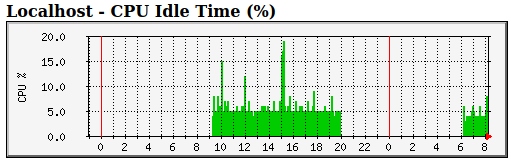

## Introduction

This article is about a software called "Multi Router Traffic Grapher" (MRTG),
which can monitor network interface usage and other values on one or more
computers.  While this article tries to be as explanatory as possible due to
the nature of the subject, it is aimed at experienced Linux users or system
administrators.

This article describes a simple installation on a server. In fact, a small
Raspberry Pi router. It should be very similar with any Debian based
distribution on other hardware too.

One advantage of using [MRTG] is that it explicitly summarizes the usage of
network devices on a daily, weekly and monthly basis in terms of **speed**.
This is useful if you are on a limited Internet connection and need to know how
fast you are.

## Dependencies

The [MRTG] is typically a multi-server installation. One server can be a web
server that collects and displays aggregated log data. Other servers or
switches can be queried via **[SNMP]**. For this article, everything is
installed on one machine.

### Web Server

One dependency for [MRTG] is the web server. This can be basically any web
server.  Out of curiosity, I tested **Nginx** (speak: engine x) and it works.
However, in the past, when [MRTG] was created, Apache was more common. For this
reason, many guides on the web have some tricks when it comes to using Apache.
You may want to consider [Apache2] if you need specific features.

#### Configuring of Nginx for MRTG

The installation is straight forward:

```bash
aptitude update
aptitude install nginx
```

Copy the following into the file `/etc/nginx/sites-available/mrtg`

~~~~~~~~~~~~~~~~~~~~~~~~~~~~~~~~~~~~~~~~~~~~~~~~~~~~~~~~~~~~~~~~~~~~~~~~~~~~~
server {
        listen 8080 default_server;
        listen [::]:8080 default_server;

        root /var/www/mrtg;
        index index.html;
        server_name _;
        location /mrtg/ {
                try_files $uri $uri/ =404;
        }
}
~~~~~~~~~~~~~~~~~~~~~~~~~~~~~~~~~~~~~~~~~~~~~~~~~~~~~~~~~~~~~~~~~~~~~~~~~~~~~

Then make a link and restart **Nginx**

```bash
cd /etc/nginx/sites-eanabled
ln -s /etc/nginx/sites-available/mrtg .
service nginx restart
```

#### Configuration of Apache2 for MRTG

Configuration can be done in many ways. [MRTG] can be configured as a main
host, virtual host, with or without SSL. The following configuration uses the
default Debian `site configuration` and does not set up [MRTG] as a site, but
as a `configuration snippet` for [Apache2].

Copy the following to the `/etc/apache2/conf-available/mrtg.conf` file.  The
values for `AllowOverride` and `Options` need to be made specific to the
server. This is just an example.

~~~~~~~~~~~~~~~~~~~~~~~~~~~~~~~~~~~~~~~~~~~~~~~~~~~~~~~~~~~~~~~~~~~~~~~~~~~~~
  <IfModule mod_alias.c>
    Alias /mrtg   /var/www/mrtg
  </IfModule>

  <Directory /var/www/mrtg/>
    Options SymLinksIfOwnerMatch
    AllowOverride None
  </Directory>

  ErrorLog  /var/log/apache2/mrtg-error.log
  CustomLog /var/log/apache2/mrtg-access.log combined
~~~~~~~~~~~~~~~~~~~~~~~~~~~~~~~~~~~~~~~~~~~~~~~~~~~~~~~~~~~~~~~~~~~~~~~~~~~~~

This kind of configuration can be enabled by `a2enconf mrtg`.

### SNMP Server

Install the **[SNMP]** server and tools.

```bash
    aptitude install snmp snmpd
```

Check if the server is running with one (!) of the following commands.

```bash
     ps ax|grep snmp|grep -v grep
     service snmpd status
```

The first command should give something like:

~~~
29529 ?        S      0:00 /usr/sbin/snmpd -Lsd -Lf /dev/null -u snmp \
-g snmp -I -smux mteTrigger mteTriggerConf -p /run/snmpd.pid
~~~

Test the server. The following command should give some output

```bash
snmpwalk -v1 -cpublic localhost

iso.3.6.1.2.1.1.1.0 = STRING: "Linux pi 4.4.9-v7+ #884 SMP Fri \
May 6 17:28:59 BST 2016 armv7l"
iso.3.6.1.2.1.1.2.0 = OID: iso.3.6.1.4.1.8072.3.2.10
iso.3.6.1.2.1.1.3.0 = Timeticks: (38719) 0:06:27.19
iso.3.6.1.2.1.1.4.0 = STRING: "Me <me@example.org>"
iso.3.6.1.2.1.1.5.0 = STRING: "pi"
iso.3.6.1.2.1.1.6.0 = STRING: "Sitting on the Dock of the Bay"
iso.3.6.1.2.1.1.7.0 = INTEGER: 72
    ...
```

As you can see from this output, some values in `/etc/snmp/snmpd.conf` are
wrong. The email address and the location "Sitting on the Dock of the Bay".
This is not necessary for basic operation. After your installation is complete,
make a backup of this configuration file and update any missing/incorrect
entries.

Especially on Debian, the problem is a very restrictive default configuration
that does not give read access to most of the MIB tree. To change this, remove
the following `-V systemonly` from the `rocommunity public default` for [IPv4]
in `/etc/snmp/snmpd.conf` and restart the `snmpd` service. If you are using
[IPv6], you need to change another line.

**before:**

```bash
snmpwalk  -v 2c -c public localhost |wc -l
47
```

**after:**

```bash
snmpwalk  -v 2c -c public localhost |wc -l
8936
```

## Installation of MRTG

The installation of [MRTG] is easy:

```bash
aptitude install mrtg
```

## MRTG Configuration

The first step is to back up the default configuration. The reason for reusing
the name `mrtg.cfg` is that `crond` or a `systemd timer` is most likely already
configured to use this file, so we do not need to modify `crond` or `systemd`.
On Debian 10, Buster [MRTG] uses cron in `/etc/cron.d/mrtg` and updates the
graphs every 5 minutes and writes log entries to `/var/log/mrtg/mrtg.log`. You
should check the log file for errors in case the configuration is updated.

```bash
cp -a /etc/mrtg.cfg /etc/mrtg.cfg.`date +'%F'`
```

Configuring the web interface is a very crude and archaic process compared to
INI or YAML files. The configuration is done via `/etc/mrtg.cfg` and is applied
by a command, since the `mrtg` command is executed by a scheduler: `crond` or
`systemd`. The format of [mrtg.cfg] can be looked up in the [mrtg-reference].

### Adding Entries/ Graphs

Most entries are added to the [mrtg.cfg] file via [SNMP] OIDs. So the first
thing to do is to look up the MIB and find out what value is accessible via
`snmpget`.

A graph entry can be generated by a set of configuration keywords associated
with an entity. For example, if we call the entity 'hobbit', then in an
abstract way it looks like this

```
KeyWord1[hobbit]: Value1
KeyWord2[hobbit]: Value2
KeyWord3[hobbit]: Value3
KeyWord4[hobbit]: Value4
KeyWord5[hobbit]: Value5
```

One of the most important keywords is the __Target__ keyword. The __value__ of
a keyword is called an __argument__ in [MRTG], probably because a keyword is
associated with a command.  For the __Target__ keyword, different commands can
be executed, which manifests itself in different __argument__ classes. So to
understand, you have to reverse the thinking. The type of value associated with
a keyword determines which command is executed. The following classes are
defined for the __target__ keyword:

- Basic
- SNMPv2c
- SNMPv3
- noHC
- Reversing
- Explicid OIDs
- MIB variables
- Snmpwalk
- SnmpGetNext
- Counted SNMP Walk
- Interface by IP
- Interface by Description
- Interface by Name
- Interface by Ethernet Address
- Interface by Type
- Extended positioning of ifIndex

Since this is quite extensive, only the __Explicid OIDs__ class is used. For
this to work, **two** OIDs must be used. The reason for this is that by default
[MRTG] plots 2 variables against time. Usually these are network bytes in and
out.  So to plot a single value, the same OID must be used twice.

The format is:

~~~
Taget[NAME]: OID_1&OID_2:COMMUNITY@HOST

  NAME: arbitrary word
  OID_1: numerical SNMP OID
  OID_2: numerical SNMP OID
  COMMUNITY: SNMP community, for example 'public'
  HOST: hostname of machine to query, for example 'localhost'
~~~

The format can be more flexible. For all places where `COMMUNITY@HOST` can be
used, the real format can be

```
COMMUNITY@HOST[:[port][:[timeout][:[retries][:[backoff][:[version]]]]][|name]
```

Also __port__ may be more flexible. See [mrtg-reference] for examples and
explanations.

What needs to be understood is that the value of __Target__ is interpolated in
a very [MRTG] specific way and some expressions are extrapolated. So addition,
subtraction, division, multiplication, parentheses and piping to custom
commands works. It is a complete language in itself.

If you find a valid OID, for example `.1.3.6.1.4.1.2021.4.6` for the total
amount of free main memory, you may need to add a `0` to make [MRTG] and [SNMP]
happy: `.1.3.6.1.4.1.2021.4.6.0`.

A target for the value would look like this:

~~~
Target[hobbit]: .1.3.6.1.4.1.2021.4.6.0&.1.3.6.1.4.1.2021.4.6.0:public@localhost
~~~

The full example for measuring free memory on a Debian 10 Buster Linux
Raspberry Pi 4 with 4 GB of memory looks like this:

__Global Configuration:__

~~~
WorkDir: /var/www/mrtg
WriteExpires: Yes
EnableIPv6: no
~~~

__Free Main Memory:__

~~~
Title[localhost-free]: Localhost free main memory
PageTop[localhost-free]: <H1>Localhost - Memory Free</H1>
Target[localhost-free]: .1.3.6.1.4.1.2021.4.6.0&.1.3.6.1.4.1.2021.4.6.0:\
public@localhost
MaxBytes[localhost-free]: 3918772
YLegend[localhost-free]: memory
ShortLegend[localhost-free]: Bytes
LegendI[localhost-free]: bytes
Legend1[localhost-free]: bytes free
Options[localhost-free]: integer, gauge, nopercent, growright, unknaszero, noo
~~~

The value for __MaxBytes__ can be queried with [SNMP]: (This assumes a working
configuration for `snmpd` - if this does not give a value, either the `snmpd`
configuration needs to be set up correctly, or you are using different
hardware).

```bash
snmpget -v 2c localhost -c public .1.3.6.1.4.1.2021.4.5.0
iso.3.6.1.4.1.2021.4.5.0 = INTEGER: 3918772
```

The configuration must then be activated

```bash
LANG=C indexmaker /etc/mrtg.cfg > /var/www/mrtg/index.html
```

Then the configuration must be run twice, because the first run will fail due
to an empty database.

```bash
LANG=C /usr/bin/mrtg  /etc/mrtg.cfg
LANG=C /usr/bin/mrtg  /etc/mrtg.cfg
```

#### Semi Automatic Configuration

Semi-automatic configuration of network interfaces is possible with the
`cfgmaker` script.

Since one interface, ``wlan0``, does not provide a speed value, to use it with
[MRTG], it is necessary to set a value with the ``-zero-speed=`` parameter.

```bash
LANG=C cfgmaker --zero-speed=100000000 public@127.0.0.1  > /etc/mrtg.cfg
```

[MRTG] has a limited ability to scan hardware and create a configuration for
it.

```bash
LANG=C cfgmaker public@127.0.0.1 --ifref=descr --output /etc/mrtg.cfg
```

This basically generates 3 interface graphs for `lo`, `eth0` and `wlan` on the
Raspberry Pi 4. Some are commented out. The `eth0` section looks like this:

~~~
#### Interface 2 >> Descr: 'eth0' | Name: 'eth0' | Ip: '192.168.168.35' | \
Eth: 'dc-a6-32-78-c1-d5' ###

Target[127.0.0.1_2]: 2:public@127.0.0.1:
SetEnv[127.0.0.1_2]: MRTG_INT_IP="192.168.168.35" MRTG_INT_DESCR="eth0"
MaxBytes[127.0.0.1_2]: 125000000
Title[127.0.0.1_2]: Traffic Analysis for 2 -- monitor
PageTop[127.0.0.1_2]: <h1>Traffic Analysis for 2 -- monitor</h1>
    <div id="sysdetails">
      <table>
        <tr>
          <td>System:</td>
          <td>monitor in monitor.c8i.org</td>
        </tr>
        <tr>
          <td>Maintainer:</td>
          <td>c  &lt;c@c8i.org&gt;</td>
        </tr>
        <tr>
          <td>Description:</td>
          <td>eth0  </td>
        </tr>
        <tr>
          <td>ifType:</td>
          <td>ethernetCsmacd (6)</td>
        </tr>
        <tr>
          <td>ifName:</td>
          <td>eth0</td>
        </tr>
        <tr>
          <td>Max Speed:</td>
          <td>125.0 MBytes/s</td>
        </tr>
        <tr>
          <td>Ip:</td>
          <td>192.168.168.35 (monitor.c8i.org)</td>
        </tr>
      </table>
    </div>
~~~

Even though the scan understands that this is the `eth0` interface, the title
name is just the number `2`. This may work fine for switches, but not for
hosts. However, clicking on the graph will show the information.

### Example Configuration For CPU Idle Time

This example shows the configuration of the CPU idle time for the Raspberry PI
4 and shows how simple mathematical terms are realized within the target
keyword.

~~~
Title[localhost-CPU]: Localhost CPU load
PageTop[localhost-CPU]: <H1>Localhost - CPU Idle Time (%)</H1>
Target[localhost-CPU]: 100 - .1.3.6.1.4.1.2021.11.11.0&\
.1.3.6.1.4.1.2021.11.11.0:public@localhost
MaxBytes[localhost-CPU]: 100
YLegend[localhost-CPU]: CPU %
ShortLegend[localhost-CPU]: %
LegendI[localhost-CPU]: CPU
Legend1[localhost-CPU]: CPU usage
Options[localhost-CPU]: integer, gauge, nopercent, growright, unknaszero, noo
~~~



### Configuring MRTG Web output

Of course, you can create an index page by hand, which is probably recommended.
A quick and dirty approach is to use the `indexmaker` script.  This creates a
page with one graph per target and a link to the target's subpage.

```bash
mkdir -p /var/www/mrtg
LANG=C indexmaker /etc/mrtg.cfg > /var/www/mrtg/index.html
```

## Updating The Data For The Web Page

Manually:

```bash
LANG=C mrtg
```

Of course this is already configured with `crond`.

## Access The New Installed MRTG

Point your web browser to the IP of your [MRTG] machine.
`http://<IP-TO-MRTG-HOST>/` or `http://<IP-TO-MRTG-HOST>/PATH`.

## Testing And Debugging

### SNMP And SNMPD

For many of the features of [MRTG] a working and well configured `snmpd` is
essential. Version 1 can be tested:

```bash
snmpstatus -c public -v1 localhost
```

This would be considered an error for example:

```
Error in packet.
Reason: (noSuchName) There is no such variable name in this MIB.
Failed object: iso.3.6.1.2.1.4.10.0

Error in packet.
Reason: (noSuchName) There is no such variable name in this MIB.
Failed object: iso.3.6.1.2.1.4.3.0

[UDP: [127.0.0.1]:161->[0.0.0.0]:45109]=>[Linux monitor 5.4.79-v7l+ #1373 SMP \
Mon Nov 23 13:27:40 GMT 2020 armv7l] Up: 0:00:54.02
Interfaces: 0, Recv/Trans packets: 0/0 | IP: 0/0
```

Version 2c can be tested with

```bash
snmpstatus -c public -v2c localhost
```

This would considered a success:

```bash
[UDP: [127.0.0.1]:161->[0.0.0.0]:49633]=>[Linux monitor 5.4.79-v7l+ #1373 SMP \
Mon Nov 23 13:27:40 GMT 2020 armv7l] Up: 0:03:16.30
Interfaces: 0, Recv/Trans packets: 0/0 | IP: 0/0
```

To query the kernel on Debian 10 Buster on Raspberry PI 4 do

```bash
snmpget -v2c -cpublic localhost iso.3.6.1.2.1.1.1.0
iso.3.6.1.2.1.1.1.0 = STRING: "Linux monitor 5.4.79-v7l+ #1373 SMP Mon Nov \
23 13:27:40 GMT 2020 armv7l"
```

There are different approaches to query the memory, one is:

```bash
 # UCD-SNMP-MIB::memTotalReal
snmpget -v2c -cpublic localhost .1.3.6.1.4.1.2021.4.5.0
iso.3.6.1.4.1.2021.4.5.0 = INTEGER: 3918772
```

### Run MRTG Manually

The cron job defines and runs [MRTG] as follows:

```bash
if [ -x /usr/bin/mrtg ] && [ -r /etc/mrtg.cfg ] && \
[ -d "$(grep '^[[:space:]]*[^#]*[[:space:]]*WorkDir' /etc/mrtg.cfg | \
awk '{ print $NF }')" ]; then mkdir -p /var/log/mrtg ; \
env LANG=C /usr/bin/mrtg /etc/mrtg.cfg 2>&1 | tee -a /var/log/mrtg/mrtg.log ; \
fi
```

This can be used to run [MRTG] immediately, rather than waiting 5 minutes.

### Running MRTG With Different Log Information

```bash
LANG=C /usr/bin/mrtg -debug cfg /etc/mrtg.cfg
```
### Debugging SNMP

This is useful for debugging `snmpget` and other [SNMP] operations, as well as
some script debugging.

```bash
LANG=C /usr/bin/mrtg -debug snpo /etc/mrtg.cfg
```

A script failure might look like

~~~
--snpo: run external sh /etc/mrtg/mrtg_ping 8.8.8.8
--snpo: External result:100 out:undef uptime:unknown name:unknown
~~~

In this case, however, the script does not return all values, so this is
actually intended.

## Packages

~~~
mrtg                - multi router traffic grapher
mrtg-contrib        - multi router traffic grapher (contributed files)
mrtg-ping-probe     - Ping module for Multi Router Traffic Grapher
mrtg-rrd            - Generating graphs for MRTG statistics (CGI)
mrtgutils           - Utilities to generate statistics for mrtg
mrtgutils-sensors   - Utilities to generate statistics for mrtg (from lm-sensors)
pcp-import-mrtg2pcp - Tool for importing data from MRTG into PCP archive logs
~~~

## Known Problems and Caveats

- The default web page (index.html) of [MRTG] will not **reload** when [MRTG]
  has manually updated the graphs. The page refresh is set to the time
  specified in the configuration, usually 10 minutes, which makes sense.
  However, when debugging or adding new configuration, [MRTG] is usually run
  manually and the page does not refresh. To mitigate this, press the browser
  reload button.
- **Devices are numbers:** At the moment the display of the index page
  enumerates devices like 2 (``eth0``) and 3 (``wlan0``), which is not very
  intuitive. I tried to use some options to ``cfgmaker`` but without success.
  If you know the answer, I would be happy to include it here.
- **No backlinks:** When you click on a device graphic on the index page, you
  can access the detailed report for each device on a dedicated page. There are
  no back links. You can change the configuration and manually add a link for
  each target in the `PageTop` attribute.
- The nice thing about [MRTG] is that it already has a daily, weekly, monthly
  and yearly overview of network interfaces **speed** (which can be generated
  automatically). However, it does not have a summary of how much KB or MB or
  GB (or KiB, MiB, GiB) the interface has processed over time (of a day, month,
  week or year) aka **accumulated traffic**. So if you want to keep track of
  your mobile plan usage, [MRTG] will not help you.

## Critique

__Pros__

- Simple architecture (configuration, cron, log file, web pages)
- Most data accessible via [SNMP] and scripts
- Easy testing of sensors
- Semi automatic setup of interface speed measurements
- Simple data model
- Moderate dependencies
- No obfuscating abstraction layers
- Reliable execution
- Low system resource usage
- It provides customizable graphs and a simple configuration process

__Cons__

  not clean)
- No back links in the web interface to the index page
- Mixing of HTML and configuration inside the configuration
- Difficult to configure new graphs from scratch
- The configuration is a complete new language
- 2 value constrains for single value graphs
- Only numeric values
- Data and markup language is not separated and even stored in log files inside
  the web root (e.g. `/var/www/mrtg/localhost-cpu.log`)
- The user interface may seem dated compared to newer monitoring tools

## Links

- [satsignal]
- [mrtg-rbp-project]

## History

| Version | Date       | Notes                                                |
| ------- | ---------- | ---------------------------------------------------- |
| 0.1.7     2023-05-01 | Improve writing                                      |
| 0.1.6   | 2022-06-06 | Change shell to bash                                 |
| 0.1.5   | 2021-05-18 | Updates for Raspberry PI 4                           |
| 0.1.4   | 2021-01-02 | Updates for Debian 10 Buster                         |
| 0.1.3   | 2020-06-06 | Formatting for Quick-Guide                           |
| 0.1.2   | 2016-06-25 | Add caveats section                                  |
| 0.1.1   | 2016-06-21 | Add Nginx configuration                              |
| 0.1.0   | 2016-06-20 | Initial release                                      |

[Apache2]: https://httpd.apache.org/
[IPv4]: https://en.wikipedia.org/wiki/IPv4
[IPv6]: https://en.wikipedia.org/wiki/IPv6
[mrtg]: https://oss.oetiker.ch/mrtg/
[mrtg.cfg]: https://oss.oetiker.ch/mrtg/doc/mrtg-reference.en.html
[mrtg-rbp-project]: https://github.com/rvdhoek/Raspberry-MRTG
[mrtg-reference]: https://oss.oetiker.ch/mrtg/doc/mrtg-reference.en.html
[OID]: https://en.wikipedia.org/wiki/Object_identifier
[satsignal]: https://www.satsignal.eu/raspberry-pi/monitoring.html
[SNMP]: https://en.wikipedia.org/wiki/Simple_Network_Management_Protocol

